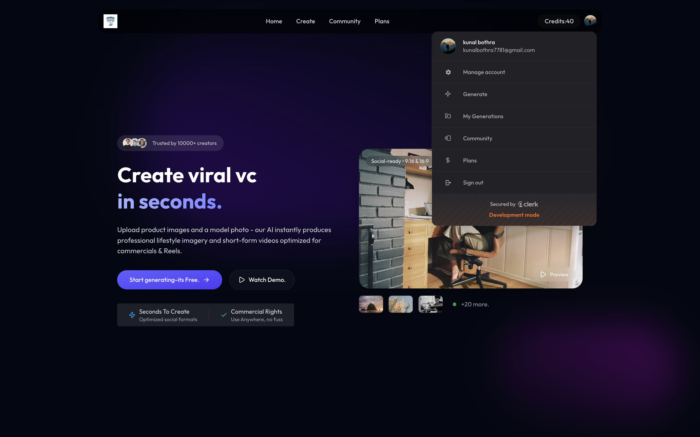
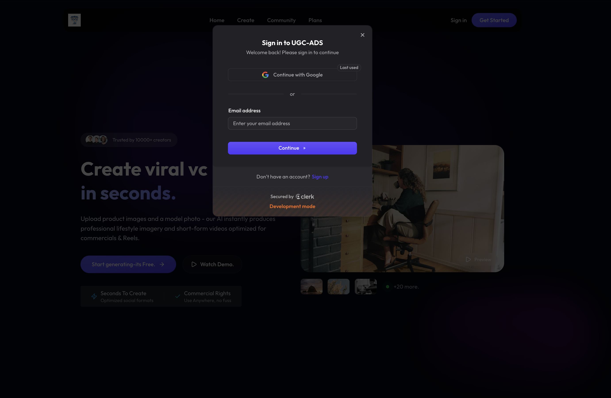
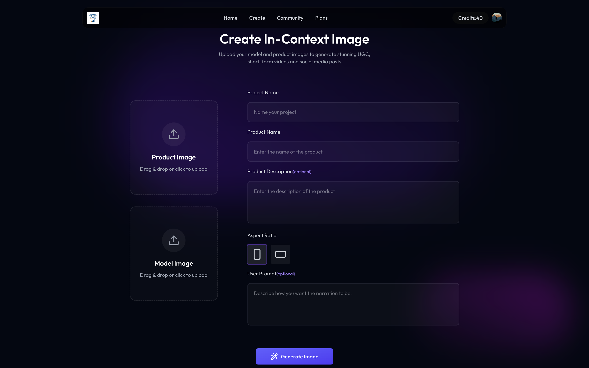
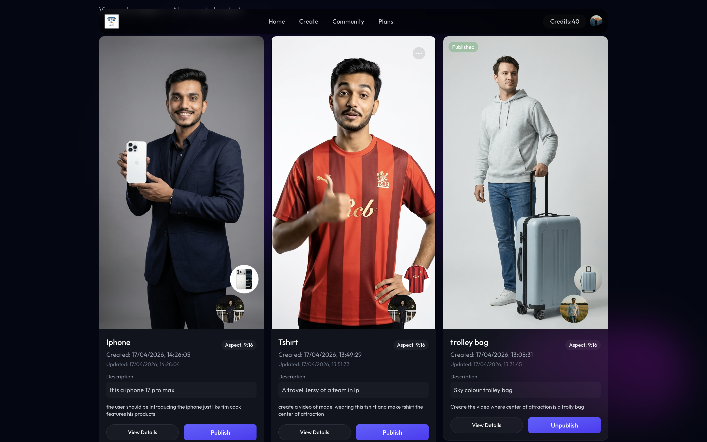
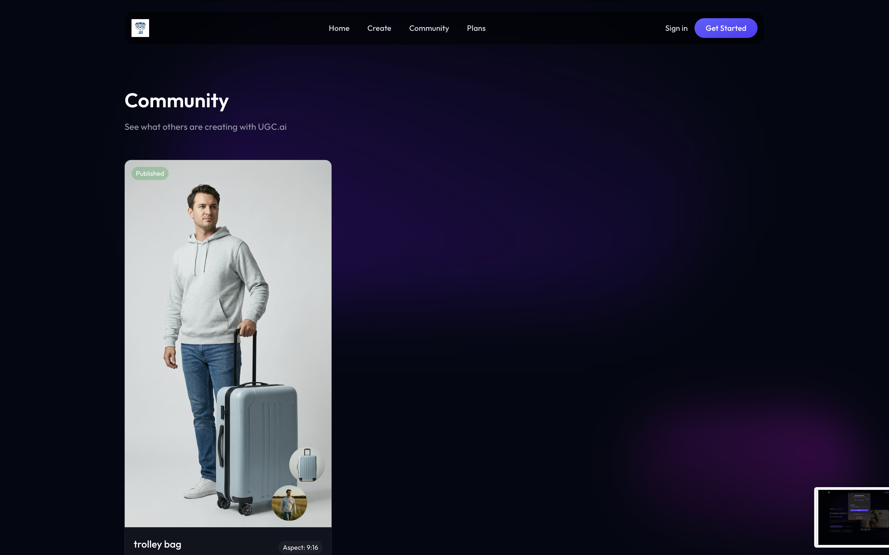
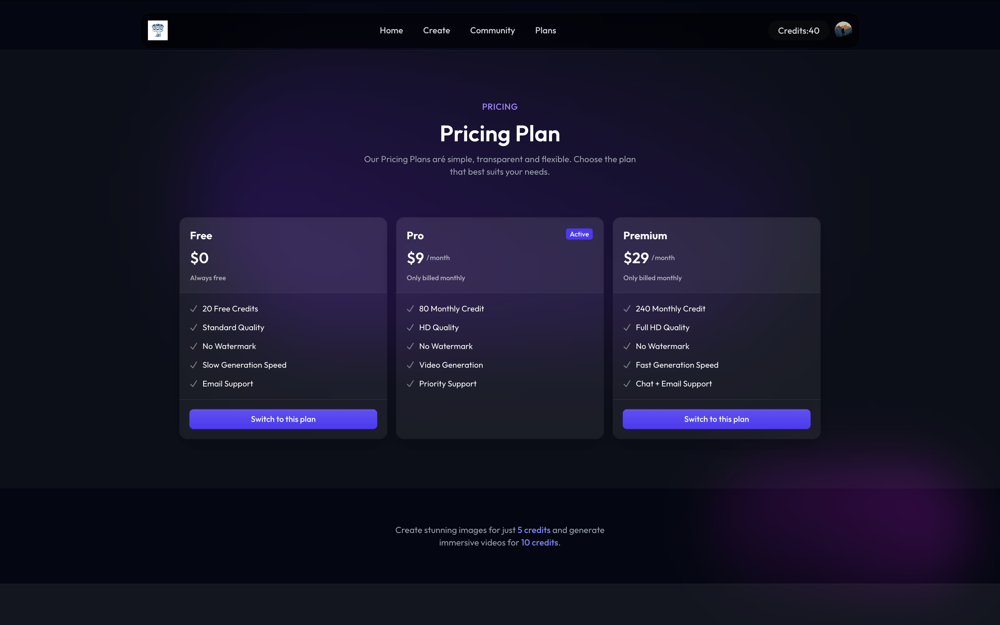

# 🚀 UGC Platform

<p align="center">
  
</p>

A modern, full-stack User-Generated Content (UGC) platform built for scale and performance. This application provides a seamless experience for uploading, managing, and interacting with media content, alongside secure authentication and AI-powered features.

---

## 🗺️ Creator Workflow & Community Roadmap

Our application follows a seamless flow from creation to community showcase:

1. **✨ Create & Generate:** Start in the **Create** studio. Upload your product and model images, enter a prompt, and let our GenAI instantly produce stunning, professional lifestyle imagery and short-form videos.
2. **👀 Review Your Assets:** Inspect your optimized, social-ready generations in your personal dashboard.
3. **🚀 Publish:** Found the perfect shot? Simply hit the **Publish** button on your generation.
4. **🌍 Community Showcase:** Upon publishing, your newly generated images dynamically appear in the **Community** section! Here, creators can explore vibrant feeds, draw inspiration, and celebrate each other's viral-ready content.

---

## 🎨 UI Previews

<p align="center">
  
  
</p>
<p align="center">
  
  
</p>
<p align="center">
  
</p>

---

## ✨ Features

- **🔐 Secure Authentication:** Seamless user authentication and session management powered by Clerk.
- **☁️ Media Management:** Seamless image and video uploading integration with Cloudinary and Multer.
- **🤖 AI Capabilities:** Built-in integration with Google GenAI for intelligent automated operations.
- **⚡ Fast Client:** Highly responsive frontend built with React 19, Vite, and Tailwind CSS v4.
- **🔒 Robust API:** Type-safe backend powered by Express, TypeScript, and Prisma ORM on a PostgreSQL database.

---

## 🛠️ Technology Stack

### Frontend (Client)
- **Framework:** React 19 + Vite
- **Styling:** Tailwind CSS v4 + Framer Motion
- **Architecture & Routing:** React Router v7
- **Authentication:** Clerk React
- **Icons & UX:** Lucide React, Lenis (Smooth Scrolling)

### Backend (Server)
- **Framework:** Node.js + Express 5 (TypeScript)
- **Database:** PostgreSQL with Prisma ORM
- **Authentication:** Clerk Express
- **Media Processing:** Multer + Cloudinary
- **AI Integration:** Google GenAI
- **Error Tracking:** Sentry

---

## 🗂️ Folder Structure

```text
ugc/
├── client/                 # 💻 React Frontend Application
│   ├── public/             # Static assets (images, icons, etc.)
│   ├── src/                # React views, generic components, and hooks
│   ├── vite.config.ts      # Vite configuration
│   └── package.json        # Client dependencies and scripts
│
├── server/                 # ⚙️ Node.js Backend Application
│   ├── configs/            # Various configuration files (Cloudinary, etc.)
│   ├── controllers/        # Express route controllers & logic
│   ├── middlewares/        # Custom Express middlewares (Auth, Error handling)
│   ├── prisma/             # Database schema and migration files
│   ├── routes/             # API endpoint definitions
│   ├── server.ts           # Main application entry point
│   └── package.json        # Server dependencies and scripts
│
└── .gitignore              # Root-level ignore configurations
```

---

## 🚀 Getting Started

Follow these instructions to get a copy of the project up and running on your local machine for development and testing purposes.

### 📋 Prerequisites

Ensure you have the following installed to run the project locally:
- **Node.js** (v18 or higher recommended)
- **npm** (v9 or higher) or yarn/pnpm equivalent
- **PostgreSQL Database** running locally or on the cloud

### ⚙️ Environment Variables

Copy the `.env.example` configurations to `.env` files in both the client and server directories before running the application.

**Client Environment Variables (`client/.env`):**
```env
VITE_CLERK_PUBLISHABLE_KEY=your_clerk_publishable_key
VITE_API_URL=http://localhost:5000
```

**Server Environment Variables (`server/.env`):**
```env
DATABASE_URL=your_postgresql_database_url
CLERK_SECRET_KEY=your_clerk_secret_key
CLOUDINARY_CLOUD_NAME=your_cloud_name
CLOUDINARY_API_KEY=your_cloudinary_api_key
CLOUDINARY_API_SECRET=your_cloudinary_api_secret
GEMINI_API_KEY=your_google_genai_key
```

### 💻 Installation

1. **Clone the repository**
   ```bash
   git clone https://github.com/kb7781/ugc.git
   cd ugc
   ```

2. **Install Client Dependencies**
   ```bash
   cd client
   npm install
   ```

3. **Install Server Dependencies**
   ```bash
   cd ../server
   npm install
   ```

### 🏃‍♂️ Running the application Locally

**1. Start the Backend Server:**
```bash
cd server
npm run server  # Runs the application in dev mode with Nodemon
```

**2. Start the Frontend Client:**
```bash
cd client
npm run dev     # Runs the Vite development server
```

The React client will be available at `http://localhost:5173` and the Express API server will listen on the port defined by your frontend configuration (usually port `5000` or `8000`).

---

## 🤝 Contributing
Contributions, issues, and feature requests are welcome!

## 📝 License
This project is proprietary and confidential.

